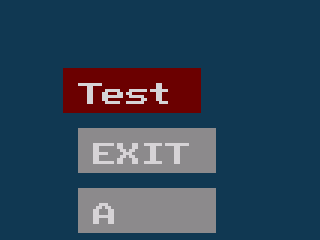

# EASYCET
A easy to use library to create fast menues on the TI84 CET
main.c contains a small sample programm using the library and showing of a few features.
# BUILD
For instructions on how to build visit cemetech.net
# Demo

  

